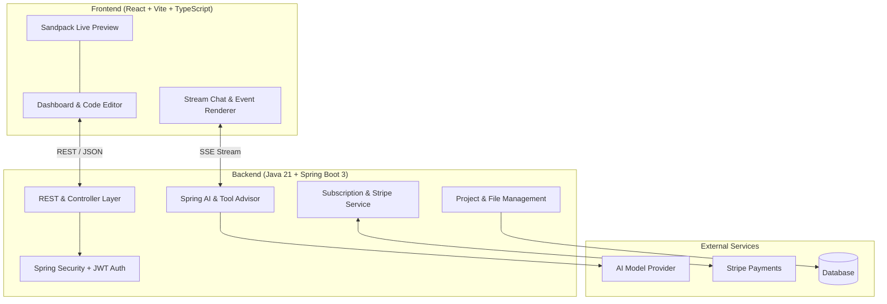

# ⚡ Lovable AI Clone - Full-Stack Application Generator

[](Frontend/)
[](Frontend/)
[](Frontend/)
[](Backend/)
[](Backend/)
[](Backend/)
[](Backend/)

A full-stack, production-ready AI development platform inspired by **Lovable.dev**. Allows users to prompt, build, preview, export, share, and deploy React applications in real time with AI assistance, integrated billing, and enterprise-grade security.

---

## 📸 Dashboard Preview

> **[INSERT DEMO GIF / SCREENSHOT HERE]**
> *Tip: Replace `docs/dashboard-preview.gif` with your recorded dashboard GIF or screenshots.*

| Interactive Code Editor & Live Preview | Chat Assistant & Event Stream |
| :---: | :---: |
| *(Add your screenshot here)* | *(Add your screenshot here)* |

---

## ✨ Key Features

### 🎨 Frontend (`/Frontend`)
- **Live Sandpack Browser Preview:** Instant live rendering of AI-generated React components in an isolated sandbox.
- **Full In-Browser Code Editor:** Multi-file editor with syntax highlighting, file tree, active tab management, and error catching.
- **Real-Time Streaming Chat:** Live stream parser for AI generation events, tool calls, and real-time feedback.
- **Export & Share:** Export generated projects as `.zip` bundles, generate shareable project links, and trigger live standalone deployments.
- **Monetization & Plans:** Subscription tier modal (Free / Pro / Enterprise), usage metrics, and Stripe checkout integration.

### ⚙️ Backend (`/Backend`)
- **Spring AI & LLM Integration:** Intelligent tool calling, advisor chains, and streaming AI code generation logic.
- **Enterprise Security:** JWT-based authentication, Spring Security filters, and fine-grained method-level authorization.
- **Billing & Subscriptions:** Full Stripe payment processor integration, webhook event handling, plan management, and credit usage tracking.
- **Project & Workspace Management:** Multi-tenant project service, template initializer, project sharing membership management, and file persistence.

---

## 🏗️ System Architecture



---

## 📁 Repository Structure

```text
Lovable-Clone/
├── 📁 Frontend/                # React + Vite + TypeScript Client
│   ├── src/
│   │   ├── components/         # CodeEditor, PreviewPanel, ChatPanel, Upgrades, Share
│   │   ├── hooks/              # Stream parser & mobile hooks
│   │   ├── pages/              # ProjectsDashboard, ProjectView, LiveView, Signup
│   │   └── lib/                # API client, types, & utility utilities
│   ├── package.json
│   └── vite.config.ts
│
├── 📁 Backend/                 # Java 21 + Spring Boot 3 Server
│   ├── src/main/java/.../
│   │   ├── controller/         # Auth, Project, File, Subscription APIs
│   │   ├── service/            # AI Generation, Chat, Project, Stripe Services
│   │   ├── security/           # JWT Filters & Authorization Setup
│   │   └── entity/             # JPA Data Entities
│   └── pom.xml                 # Maven Dependencies (Spring Boot, Spring AI, Stripe)
│
└── 📄 README.md                # Unified Monorepo Documentation
```

---

## 🚀 Getting Started

### Prerequisites
- **Node.js** v18+ & `npm` / `bun`
- **Java JDK** 21+
- **Maven** 3.8+

### 1️⃣ Run the Backend Server
```bash
cd Backend
./mvnw spring-boot:run
```
> The API server will start on `http://localhost:8080`.

### 2️⃣ Run the Frontend App
```bash
cd Frontend
npm install
npm run dev
```
> The application UI will be accessible at `http://localhost:5173`.

---

## 🛠️ Built With

- **Frontend:** React 18, TypeScript, Vite, Tailwind CSS, Lucide Icons, Shadcn UI, Sandpack CodeSandbox SDK.
- **Backend:** Java 21, Spring Boot 3, Spring AI, Spring Security, JWT, Stripe Java SDK, MapStruct, Lombok, Maven.

---

## 📜 License

Distributed under the MIT License. See `LICENSE` for details.
