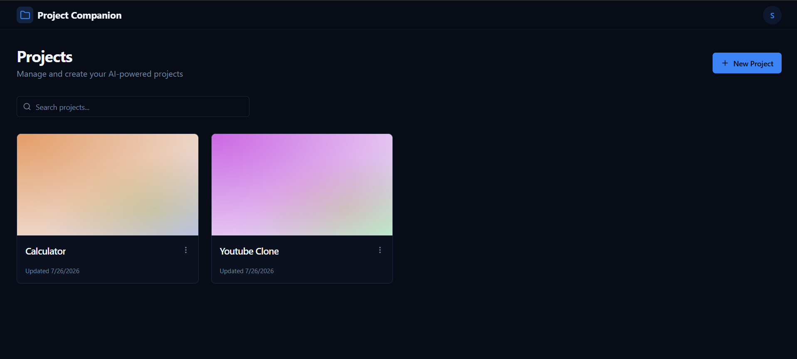
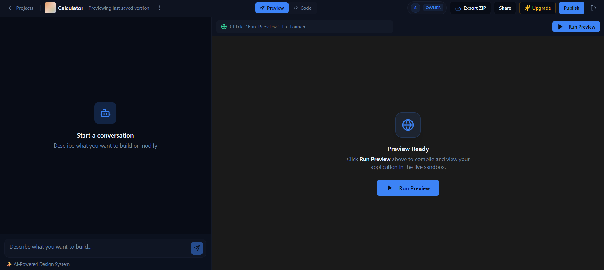
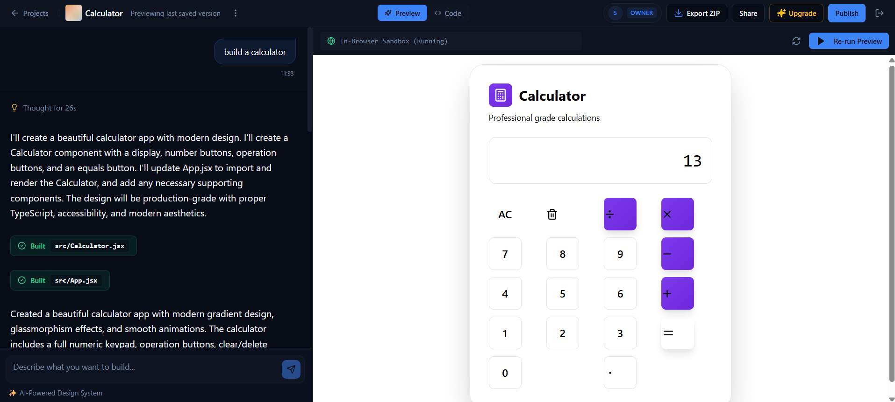
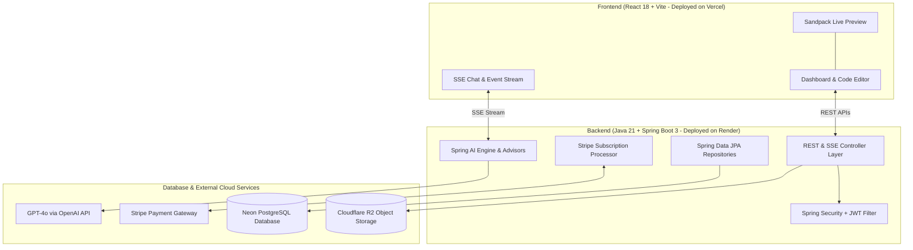

# ⚡ AI-Powered Full-Stack App Builder

[](LICENSE)
[](Frontend/)
[](Frontend/)
[](Frontend/)
[](Backend/)
[](Backend/)
[](Backend/)
[](Backend/)
[](Backend/)
[](Backend/)
[](Backend/)

Lovable AI Clone is a full-stack AI application generator inspired by **Lovable.dev**. It transforms natural language prompts into complete React projects with components, pages, routing, and supporting files, featuring real-time code generation, live preview, secure authentication, Stripe billing, and project management.

---

## 📋 Table of Contents

- [📸 Screenshots Showcase](#-screenshots-showcase)
- [📊 Project Stats](#-project-stats)
- [⚡ Highlights](#-highlights)
- [🛠️ Tech Stack](#️-tech-stack)
- [💡 Architecture & Design Decisions](#-architecture--design-decisions)
- [📁 Repository Structure](#-repository-structure)
- [✨ Key Features & Technical Implementation](#-key-features--technical-implementation)
- [🗄️ Database](#️-database)
- [🔌 Key REST APIs](#-key-rest-apis)
- [🏗️ System Architecture](#️-system-architecture)
- [🚀 Deployment Environment](#-deployment-environment)
- [🔑 Environment Variables](#-environment-variables)
- [💻 Installation & Setup](#-installation--setup)

---

## 📸 Screenshots Showcase

| **Projects Dashboard** | **Code Editor & Sandpack Preview** |
| :---: | :---: |
|  |  |
| *Multi-project workspace management* | *In-browser code editor and Sandpack preview* |

| **AI Chat & Event Stream** | **Stripe Checkout & Billing** |
| :---: | :---: |
|  |  |
| *SSE stream parser and tool calling* | *Subscription plan upgrade modal* |

---

## 📊 Project Stats

- **60+** Java Backend Classes, Controllers, Entities & DTOs
- **40+** React TypeScript Components, Hooks & Pages
- **12+** Verified REST Endpoints & SSE Streaming Channels
- **Multi-Module** Monorepo Architecture (`/Frontend` & `/Backend`)
- **JWT** Authentication with Spring Security Filter Chain
- **Permission-Based Security:** Fine-grained project member authorization (`VIEW`, `EDIT`, `DELETE`, `MANAGE_MEMBERS`)
- **SSE** Real-Time Code Streaming (`MediaType.TEXT_EVENT_STREAM_VALUE`)
- **Stripe** Subscription & Webhook Signature Processing
- **Cloudflare R2 / MinIO** S3-Compatible Object Storage
- **Docker & Docker Compose** Local Infrastructure Services

---

## ⚡ Highlights

- **AI-Powered Code Generation:** Transform natural language prompts into complete React projects with components, pages, routing, and supporting files.
- **Streaming Responses:** Token-by-token code generation streaming using Spring AI and Server-Sent Events (SSE).
- **Live Sandpack Preview:** Instant in-browser component preview with hot updates and isolated sandbox execution.
- **JWT Authentication:** Token-based authentication with Spring Security filter chain.
- **Stripe Billing:** Subscription tiers (Free, Pro, Enterprise) with automated webhook lifecycle handling.
- **Multi-Project Workspaces:** Workspace project creation, dynamic file trees, in-browser editor, member sharing, and ZIP export.

---

## 🛠️ Tech Stack

| Layer | Technology |
|---|---|
| **Frontend** | React 18, TypeScript, Vite, Tailwind CSS, Shadcn UI, Sandpack SDK |
| **Backend** | Java 21, Spring Boot 3, Maven |
| **AI Engine** | GPT-4o via OpenAI API & Spring AI (Structured Output Advisors & Tool Calling) |
| **Database** | PostgreSQL, Spring Data JPA, Hibernate ORM |
| **Security** | JWT Authentication, Spring Security Filter Chain, Security Expressions |
| **Billing** | Stripe Java SDK, Webhook Signature Validation |
| **Storage** | Cloudflare R2 / MinIO (S3-Compatible Object Storage) |
| **Infrastructure** | Docker & Docker Compose |
| **Deployment** | Vercel (Frontend), Render (Backend), Neon (Database) |

---

## 💡 Architecture & Design Decisions

- **Spring AI Framework:** Used to abstract LLM interactions, manage system prompts, and execute structured tool calls for code output.
- **Server-Sent Events (SSE):** Selected over WebSockets for unidirectional token streaming, reducing protocol overhead for real-time code generation.
- **Stateless JWT Sessions:** Session authentication implemented via JWT bearer tokens for stateless REST scalability.
- **Permission-Based Authorization:** Custom `@Component("security")` bean evaluating project member roles and granular permissions.
- **PostgreSQL Relational Storage:** Structured relational schema enforcing data integrity across user accounts, project metadata, workspace files, and billing logs.
- **S3-Compatible Object Storage:** Cloudflare R2 (Production) and MinIO (Local) for S3-compatible file storage handling generated project file bundles and snapshots.

---

## 📁 Repository Structure

```text
Lovable-Clone/
├── 📁 Frontend/                # React 18 + Vite + TypeScript Client (Vercel)
│   ├── src/
│   │   ├── components/         # CodeEditor, PreviewPanel, ChatPanel, Upgrades, Share
│   │   ├── hooks/              # Stream parser & mobile responsiveness hooks
│   │   ├── pages/              # ProjectsDashboard, ProjectView, LiveView, Signup
│   │   └── lib/                # API client, types, & utility functions
│   ├── package.json
│   └── vite.config.ts
│
├── 📁 Backend/                 # Java 21 + Spring Boot 3 Server (Render)
│   ├── src/main/java/.../
│   │   ├── controller/         # Auth, Project, Member, File, Chat, Subscription APIs
│   │   ├── service/            # AI Generation, Chat, Project, Stripe Services
│   │   ├── security/           # JWT Filters & Security Expressions Setup
│   │   ├── entity/             # JPA Data Entities
│   │   └── llm/                # Spring AI Advisors & Code Generation Tools
│   ├── services.docker-compose.yml
│   └── pom.xml                 # Maven Dependencies
│
└── 📄 README.md                # Unified Monorepo Documentation
```

---

## ✨ Key Features & Technical Implementation

- **Live Sandpack Preview:** Isolated browser sandbox execution with hot component reload and runtime error boundary handling.
- **Secure Authentication:** Token-based authentication using Spring Security filter chain, JWT verification, and project permission checks.
- **SSE Stream Parser:** Reactive `Flux<ServerSentEvent<StreamResponse>>` endpoint emitting live file generation phases, system events, and error diagnostics.
- **Stripe Billing Integration:** Webhook event handlers listening for payment success, subscription cancellations, and credit allocation.
- **Workspace & File System:** Hierarchical file manager supporting multi-file editing, member invitations (`/api/projects/{id}/members`), and `.zip` archive downloads.

---

## 🗄️ Database

- **PostgreSQL:** Relational database management system storing user entities, project records, file nodes, member permissions, and subscription transactions.
- **Spring Data JPA:** Data access layer providing type-safe repositories, custom JPQL queries, and pagination.
- **Hibernate ORM:** Entity lifecycle management, lazy loading strategies, and schema creation.

---

## 🔌 Key REST APIs

| Endpoint | Method | Type | Description |
|---|---|---|---|
| `/api/auth/login` | `POST` | REST | User authentication & JWT issuance |
| `/api/projects` | `POST` | REST | Create a new AI workspace project |
| `/api/projects` | `GET` | REST | Fetch workspace projects for the current user |
| `/api/projects/{id}` | `GET` | REST | Retrieve project file tree & metadata |
| `/api/projects/{id}/members` | `GET` / `POST` | REST | Fetch & invite project workspace members |
| `/api/chat/stream` | `POST` | **SSE Stream** | Stream AI response tokens & code updates |
| `/api/chat/projects/{id}` | `GET` | REST | Fetch historical project chat logs |
| `/api/usage` | `GET` | REST | Retrieve account credit usage & subscription plan |
| `/api/subscriptions` | `POST` | REST | Initiate plan upgrades or payment sessions |
| `/api/stripe/webhook` | `POST` | REST | Handle automated Stripe webhook events |

---

## 🏗️ System Architecture



---

## 🚀 Deployment Environment

- **Frontend:** Vercel (`https://your-app.vercel.app`)
- **Backend:** Render (`https://lovable-backend.onrender.com`)
- **Database:** Neon PostgreSQL (`jdbc:postgresql://ep-xyz.neon.tech:5432/neondb`)
- **Storage:** Cloudflare R2 (S3-Compatible API)
- **Payments:** Stripe API & Webhooks

---

## 🔑 Environment Variables

Create a `.env` file from the `.env.example` template:

```env
# AI Model Configuration
OPENAI_API_KEY=your_openai_api_key_here

# Database Configuration (Neon PostgreSQL)
SPRING_DATASOURCE_URL=jdbc:postgresql://ep-xyz.neon.tech:5432/neondb?sslmode=require
SPRING_DATASOURCE_USERNAME=your_neon_username
SPRING_DATASOURCE_PASSWORD=your_neon_password

# Security Configuration
JWT_SECRET_KEY=your_super_secret_jwt_key_minimum_32_characters

# Stripe Payments
STRIPE_API_SECRET=sk_test_51...
STRIPE_WEBHOOK_SECRET=whsec_...

# Object Storage (Cloudflare R2 / MinIO)
MINIO_URL=https://<account_id>.r2.cloudflarestorage.com
MINIO_ACCESS_KEY=your_r2_access_key
MINIO_SECRET_KEY=your_r2_secret_key
```

---

## 💻 Installation & Setup

### Prerequisites
- **Node.js** v18+
- **Java JDK** 21+
- **Maven** 3.8+
- **Docker & Docker Compose** (for local development)

### 1️⃣ Clone & Configure Environment
```bash
git clone https://github.com/rayshivam30/Lovable-Clone.git
cd Lovable-Clone
cp .env.example .env
```

### 2️⃣ Start Local Infrastructure (PostgreSQL & MinIO)
```bash
cd Backend
docker compose -f services.docker-compose.yml up -d
```

### 3️⃣ Run the Backend
```bash
cd Backend
./mvnw spring-boot:run
```
> Backend runs at `http://localhost:8080`

### 4️⃣ Run the Frontend
```bash
cd Frontend
npm install
npm run dev
```
> Frontend runs at `http://localhost:5173`

---

## 📜 License

Distributed under the MIT License. See [LICENSE](LICENSE) for details.
